# PetBuddies AI — Challenge FIAP 2026 | Java Advanced

API REST e telas web do **PetBuddies**, o cuidado contínuo de pets entre a clínica veterinária e o tutor. Challenge de **Java Advanced (2TDS)**, FIAP 2026.

A veterinária atende, prescreve e monta o plano de cuidado. Em casa, o tutor conta em texto livre como o animal está, e o serviço transforma esse relato na conduta que a veterinária deixou assinada.

- **Cadastro e agenda da clínica:** clínica, equipe, tutores, pacientes, janelas de atendimento e consultas.
- **Atendimento e prescrição:** a consulta fecha com registro, procedimentos e prescrições numa operação só, e a IA monta o rascunho da prescrição a partir da fala da veterinária.
- **Plano de cuidado:** vacinas, vermífugos e retornos gerados a partir dos protocolos que a clínica configura no `PetBuddies-API` (.NET).
- **Check-in do tutor:** a IA reconhece no relato as condições clínicas que a veterinária definiu, e um motor determinístico aplica as regras dela para decidir a dose do dia ou acionar a clínica.
- **Dois perfis:** `VET` e `TUTOR`, com token JWT para o app mobile e sessão para as telas web.

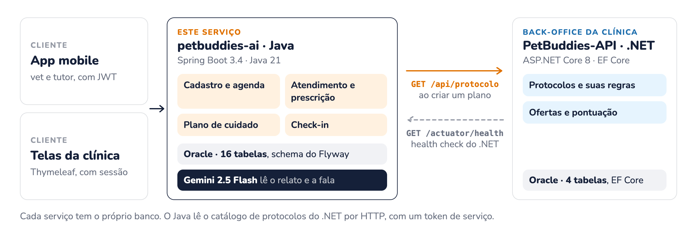

## Índice

1. [Integrantes do Grupo](#integrantes-do-grupo)
2. [Configuração — Spring Initializr](#configuração--spring-initializr)
3. [Stack](#stack)
4. [Estrutura do Projeto](#estrutura-do-projeto)
5. [Como Executar](#como-executar)
6. [Diagrama de classes](#diagrama-de-classes)
7. [Autenticação e perfis](#autenticação-e-perfis)
8. [Fluxos Principais](#fluxos-principais)
9. [Superfície web (Thymeleaf)](#superfície-web-thymeleaf)
10. [Recursos e Rotas](#recursos-e-rotas)
11. [Como Testar](#como-testar)
12. [Exemplos de Payload](#exemplos-de-payload)

---

## Links

|                               | |
|-------------------------------|---|
| Deploy (telas web)            | http://petbuddies-java-rm563925.eastus.azurecontainer.io:8080 |
| Swagger UI (produção)         | http://petbuddies-java-rm563925.eastus.azurecontainer.io:8080/swagger-ui.html |
| Swagger UI (local)            | `http://localhost:8080/swagger-ui.html` |
| Postman collection            | [`docs/postman/petbuddies-ai-java.postman_collection.json`](docs/postman/petbuddies-ai-java.postman_collection.json) |
| Vídeo de apresentação         | (https://youtu.be/VrChl50hDlo)](https://youtu.be/VrChl50hDlo) |

---

## Integrantes do Grupo

| Nome | RM |
|------|----|
| Felipe Yuiti Ishii | 565339 |
| Gabriel Nogueira Peixoto | 563925 |
| Giovanna Neri dos Santos | 566154 |
| Mariana Inoue | 565834 |

---

## Configuração — Spring Initializr

| Dependência | Categoria | Descrição |
|-------------|-----------|-----------|
| Spring Web | WEB | controllers REST e MVC no mesmo processo |
| Spring HATEOAS | WEB | `_links` / `_embedded` em toda resposta de recurso |
| Thymeleaf | WEB | as 8 telas server-rendered, vet e tutor |
| Spring Data JPA | SQL | 16 entidades JPA, um repositório por agregado |
| Oracle Driver (`ojdbc11`) | SQL | Oracle 23 local (`gvenzl/oracle-free`) ou Oracle FIAP |
| Flyway (`flyway-core` + `flyway-database-oracle`) | SQL | dono do schema — `V1` cria as 16 tabelas, `ddl-auto=validate` |
| Spring Security | SEGURANÇA | duas cadeias: API com Bearer JWT, web com formulário e sessão |
| jjwt (`api`/`impl`/`jackson`) | SEGURANÇA | emissão e validação do token HS256 |
| Spring AI (`spring-ai-starter-model-openai`) | AI | Gemini 2.5 Flash via camada de compatibilidade OpenAI |
| Bean Validation | I/O | validação de DTOs com anotações Jakarta |
| Spring Boot Actuator | OPS | `GET /actuator/health` aberto, com o status da aplicação e do banco |
| Springdoc OpenAPI | DEV | Swagger UI com tags por domínio |
| Lombok | DEV | `@Getter @Setter @NoArgsConstructor @AllArgsConstructor` em entidades e DTOs |
| spring-dotenv | DEV | carrega `.env` em desenvolvimento local |

---

## Stack

- **Java 21** · Spring Boot 3.4.5
- **Spring AI 1.1.6** — Gemini `gemini-2.5-flash`, `temperature=0`
- **Spring Data JPA + Hibernate** sobre **Oracle** (23 local via `gvenzl/oracle-free`, ou FIAP)
- **Flyway** — dono do schema (`ddl-auto=validate`, nunca `update`)
- **Spring Security** — duas cadeias (API com Bearer, web com formulário) e JWT via `jjwt`
- **Spring HATEOAS** — respostas em `EntityModel`/`CollectionModel`, com assemblers dedicados
- **Spring Boot Actuator** — só o `health` exposto
- **Bean Validation** (Jakarta) · **Springdoc OpenAPI 2.8.8** · **Lombok**

---

## Estrutura do Projeto

```
br/com/fiap/petbuddies/
├── controller/              # REST — um subpacote por domínio
│   ├── identidade/          # AuthController
│   ├── cadastro/            # Clinica, Veterinario, Responsavel, Animal
│   ├── atendimento/         # Consulta, JanelaAtendimento, RegistroAtendimento, Procedimento, CondicaoClinica
│   ├── prescricao/          # Prescricao, RegraPrescricao, ExtracaoPrescricao
│   ├── cuidado/             # MotorPlanoController
│   └── checkin/             # CheckinController
├── web/                     # 8 telas Thymeleaf
│   └── form/                # objeto de formulário quando o DTO de request não cobre a tela
├── service/                 # regra de negócio — mesmos subpacotes do controller
├── dto/                     # um subpacote por domínio, flat
├── domain/
│   ├── entity/              # 16 entidades JPA
│   ├── embeddable/          # 6 valores @Embeddable, gravados nas colunas da entidade dona
│   ├── enums/               # um subpacote por domínio, @Enumerated(STRING)
│   └── repository/          # um JpaRepository por entidade
├── assembler/               # RepresentationModelAssembler (HATEOAS), um por recurso
├── infrastructure/client/   # ProtocoloClient — a chamada ao .NET
├── security/                # SecurityConfig, TokenService, TokenAuthenticationFilter, UsuarioPrincipal
├── exception/               # exceções de domínio — mesmos subpacotes do controller
├── handler/                 # GlobalExceptionHandler (API) e WebExceptionHandler (telas)
└── config/                  # OpenApiConfig, CuidadoPersistenceConfig
```

---

## Como Executar

### Pré-requisitos

- Java 21+ · Maven 3.9+ (este repositório não versiona o Maven Wrapper — use o `mvn` do sistema)
- Docker, para o Oracle local — **ou** acesso ao Oracle FIAP
- Uma chave do Gemini ([Google AI Studio](https://aistudio.google.com))

### Banco local (recomendado)

```bash
cp .env.example .env
# preencha ORACLE_PASSWORD, ORACLE_SYS_PASSWORD, PETBUDDIES_JWT_SECRET e GEMINI_API_KEY

docker compose up -d --wait                          # sobe só o Oracle
mvn spring-boot:run -Dspring-boot.run.profiles=dev
```

Para rodar mais de uma instância em paralelo, parametrize porta e projeto:

```bash
COMPOSE_PROJECT_NAME=minha-instancia ORACLE_PORT=1581 docker compose up -d --wait
```

Derrube com `docker compose down -v`. Os bancos desta sprint são resetados a cada subida, não migrados.

### Oracle FIAP (alternativa)

```bash
cp .env.example .env
# ORACLE_URL já aponta para o Oracle FIAP; preencha ORACLE_USER (seu RM) e ORACLE_PASSWORD

mvn spring-boot:run -Dspring-boot.run.profiles=dev
```

A aplicação sobe em `http://localhost:8080`, com o Swagger em `/swagger-ui.html`.

### Variáveis de ambiente

Todas em `.env.example`; `.env` está no `.gitignore`.

| Variável | Para quê |
|---|---|
| `ORACLE_URL` | conexão com o Oracle. Default aponta para o Oracle FIAP; o `docker-compose.yml` aponta para o container local |
| `ORACLE_USER`, `ORACLE_PASSWORD` | credencial do schema. **A aplicação não sobe sem elas.** `ORACLE_USER` em maiúsculas — o Oracle guarda nome de schema assim |
| `ORACLE_SYS_PASSWORD` | senha do `SYS` do container local; só o `docker-compose.yml` usa |
| `ORACLE_PORT` | porta do Oracle no host, para rodar instâncias em paralelo |
| `PETBUDDIES_JWT_SECRET` | segredo `HS256` do token — mínimo 32 bytes, o mesmo valor do .NET. Abaixo disso a aplicação recusa subir |
| `GEMINI_API_KEY` | chave do Gemini. Ausente do ambiente, a aplicação não sobe; presente mas vazia, sobe e só as chamadas de IA falham |

### Usuários de demonstração

`V2__seed_demonstracao.sql` semeia uma clínica, um veterinário, um responsável e dois usuários:

| Login | Perfil | Senha |
|---|---|---|
| `ana@clinica.com` | `VET` | `petbuddies123` |
| `maria@email.com` | `TUTOR` | `petbuddies123` |

---

## Diagrama de classes

As 16 entidades JPA em seis pacotes de domínio, com os seis valores `@Embeddable` de `domain/embeddable/`. No código, cada entidade leva o sufixo `Entity`.

| Notação | Significado |
|---|---|
| seta cheia `——>` | `@ManyToOne` navegável, com a multiplicidade em cada ponta |
| losango cheio `◆——` | composição: `PlanoCuidado` e seus itens (`cascade = ALL`) |
| losango laranja `◆——` | valor `@Embeddable` gravado nas colunas da própria entidade |
| seta tracejada `- - >` | referência por id: um `Long` sem relação JPA |
| caixa tracejada `«Pacote» Classe` | classe de outro pacote, apontada a partir deste |

Clique numa miniatura para abrir o diagrama inteiro.

<table>
<tr>
<td width="33%" valign="top">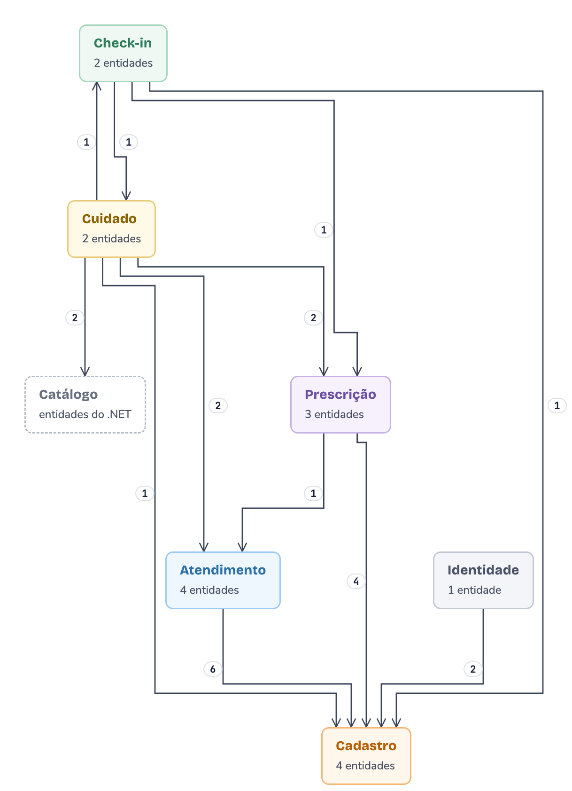<br><b>Pacotes</b> · a seta sai de quem referencia; o número conta as referências</td>
<td width="33%" valign="top">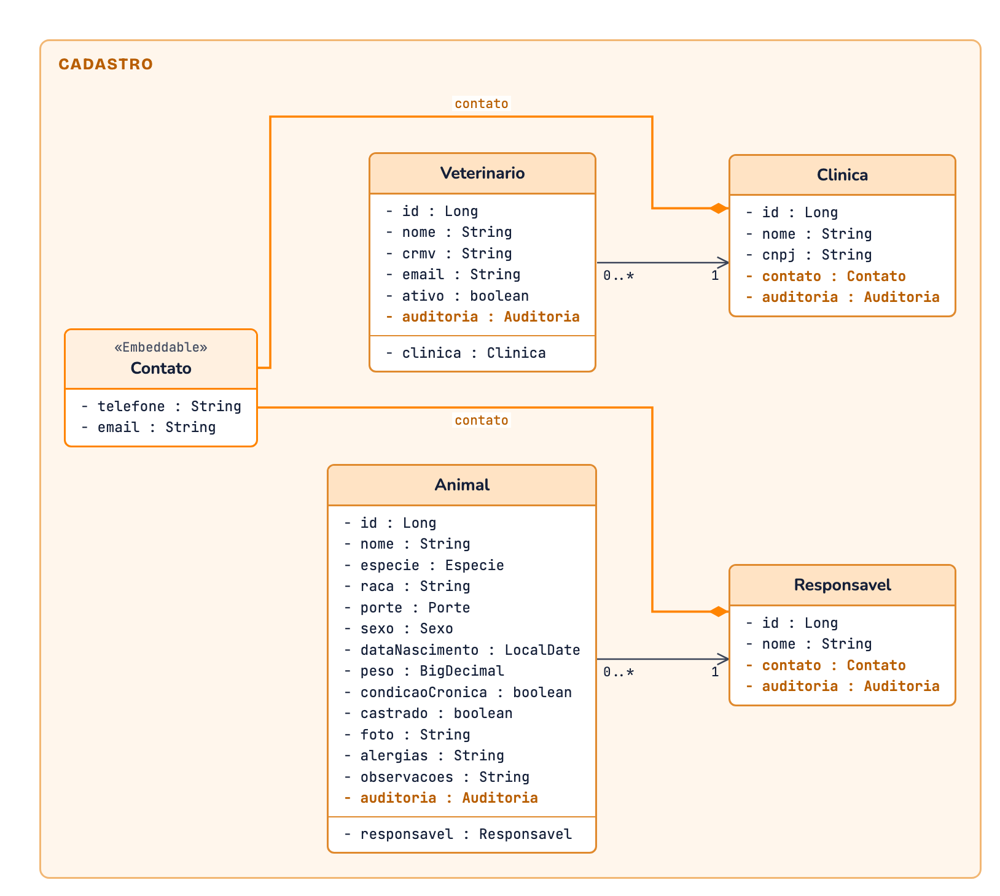<br><b>Cadastro</b> · clínica, veterinário, responsável e animal</td>
<td width="33%" valign="top">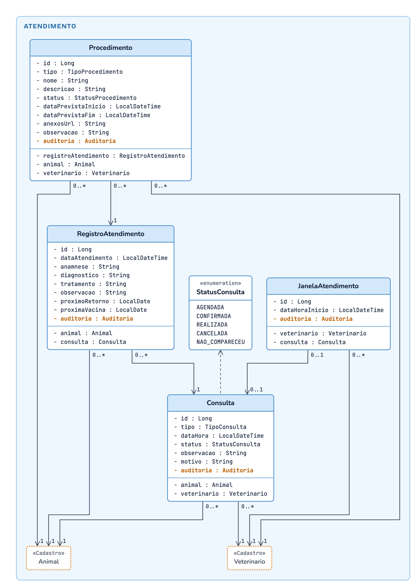<br><b>Atendimento</b> · janela, consulta, registro e procedimento</td>
</tr>
<tr>
<td width="33%" valign="top">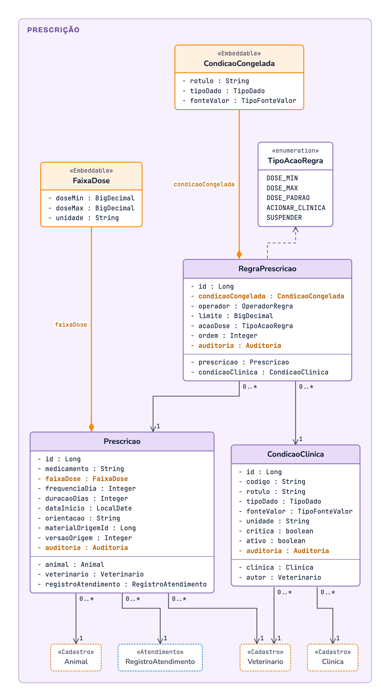<br><b>Prescrição</b> · condição clínica, prescrição e regra</td>
<td width="33%" valign="top">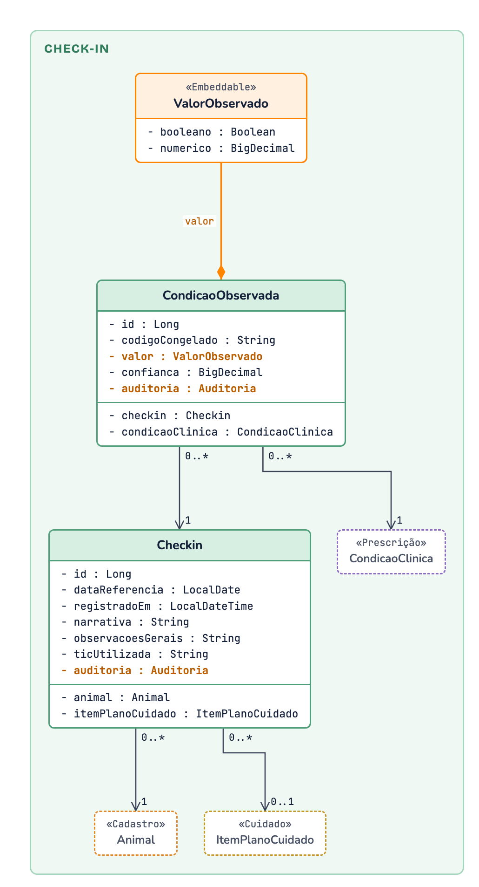<br><b>Check-in</b> · check-in e condição observada</td>
<td width="33%" valign="top">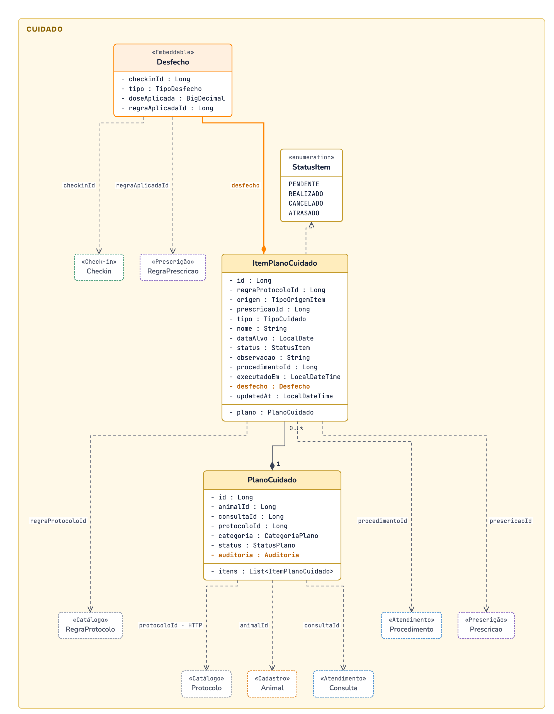<br><b>Cuidado</b> · plano e itens do plano</td>
</tr>
<tr>
<td width="33%" valign="top">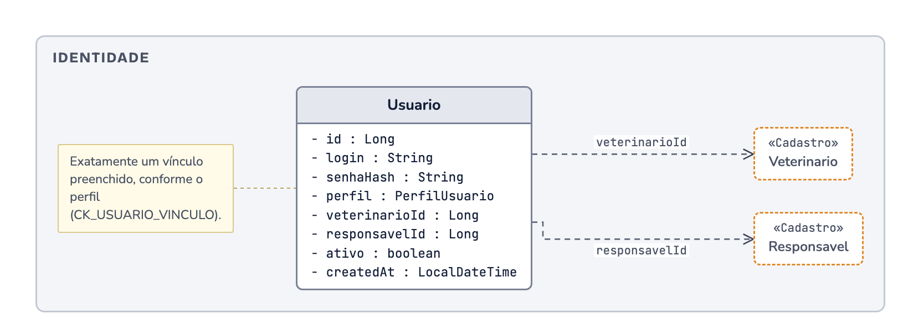<br><b>Identidade</b> · usuário, perfil e vínculo</td>
<td width="33%" valign="top">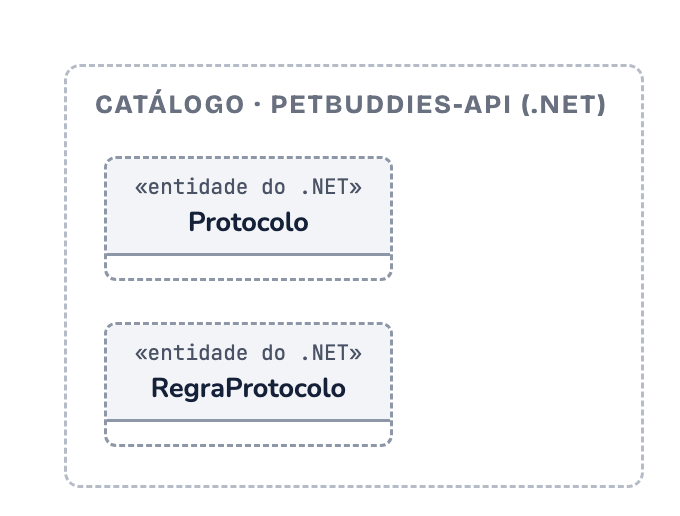<br><b>Catálogo</b> · protocolo e regra, lidos do .NET por HTTP</td>
<td width="33%" valign="top">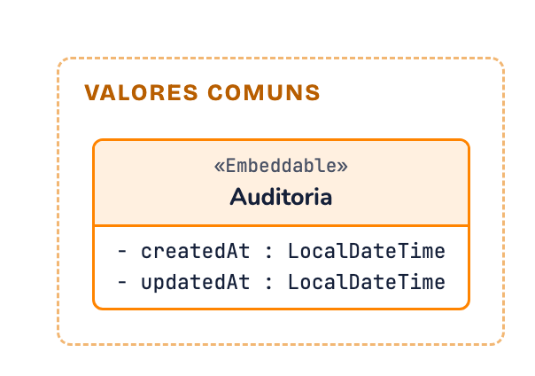<br><b>Auditoria</b> · embutida em 14 entidades, mostrada uma vez</td>
</tr>
</table>

---

## Autenticação e perfis

Duas cadeias de segurança no mesmo processo:

| Cadeia | Quem usa | Como autentica |
|---|---|---|
| `/api/**` | app mobile e integrações | `Authorization: Bearer <JWT>` (HS256) |
| telas Thymeleaf | navegador | formulário em `/login`, sessão e logout |

O token carrega o perfil (`VET` ou `TUTOR`) e o vínculo (`veterinarioId` ou `responsavelId`), e é o mesmo aceito pelo `PetBuddies-API` (.NET) — o segredo é compartilhado.

**Rotas por perfil na API:** a regra segue o que o app faz com cada perfil. Os dois perfis cadastram, editam e removem animal, editam o responsável, agendam e cancelam consulta. O veterinário é o único que abre consulta direta, fecha atendimento, registra atendimento e procedimento, prescreve, cria regra e condição clínica, abre janela, instancia plano e cadastra veterinário e clínica. O check-in é só do tutor. Todo `GET` aceita qualquer token válido. Perfil sem permissão recebe `403`, nunca `401`, e a remoção de animal ainda confere o dono.

**Rotas por perfil na web:** `/painel`, `/clinica`, `/equipe`, `/tutores`, `/pacientes` e `/agenda` exigem `VET`; `/meus-animais` exige `TUTOR`. O tutor recebe `403` nas rotas da clínica, e a lista dele é escopada pelo `responsavelId` da sessão, nunca por parâmetro na URL.

---

## Fluxos Principais

### Plano de cuidado a partir de protocolo

O único fluxo que atravessa os dois serviços.

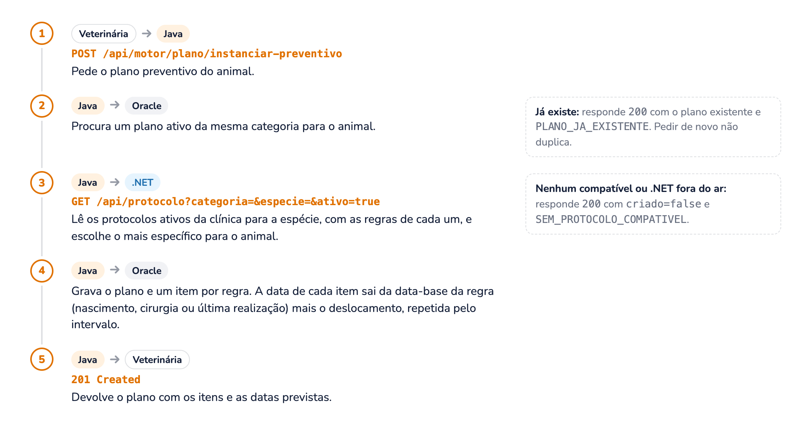

### Check-in narrado

A IA interpreta; **o motor determinístico decide a dose**.

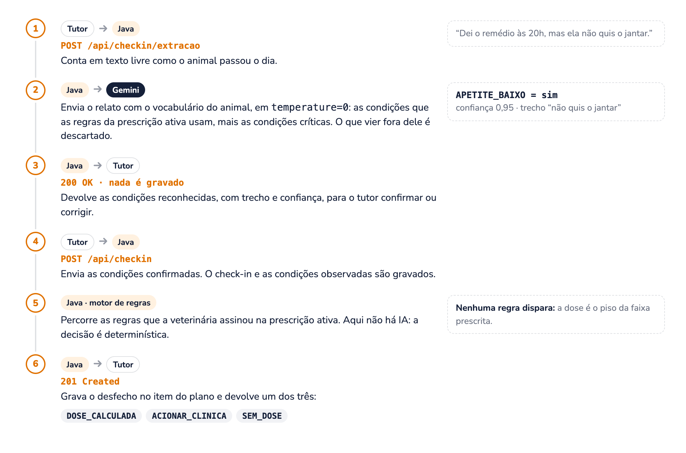

Uma regra de comportamento que a integração precisa conhecer: **cada condição vem com `confianca` entre 0 e 1.** Abaixo de `0.7` a leitura é uma inferência do modelo, não algo que o tutor disse — o app deve confirmar antes de seguir.

---

## Superfície web (Thymeleaf)

8 telas server-rendered, layout compartilhado por fragmentos. O login redireciona por perfil.

| Rota | Perfil | O que faz |
|---|---|---|
| `/login` | público | formulário de acesso |
| `/painel` | `VET` | visão geral da clínica |
| `/clinica` | `VET` | dados da clínica |
| `/equipe` | `VET` | veterinários — lista e cadastro |
| `/tutores` | `VET` | responsáveis — lista e cadastro |
| `/pacientes` | `VET` | animais, ficha clínica e instanciação de plano |
| `/agenda` | `VET` | consultas, agendamento e fechamento de atendimento |
| `/meus-animais` | `TUTOR` | os animais do próprio tutor |

Erro de negócio numa tela devolve página HTML, não JSON — o `WebExceptionHandler` intercepta antes do handler da API.

### Telas

<table>
<tr>
<td width="50%" valign="top">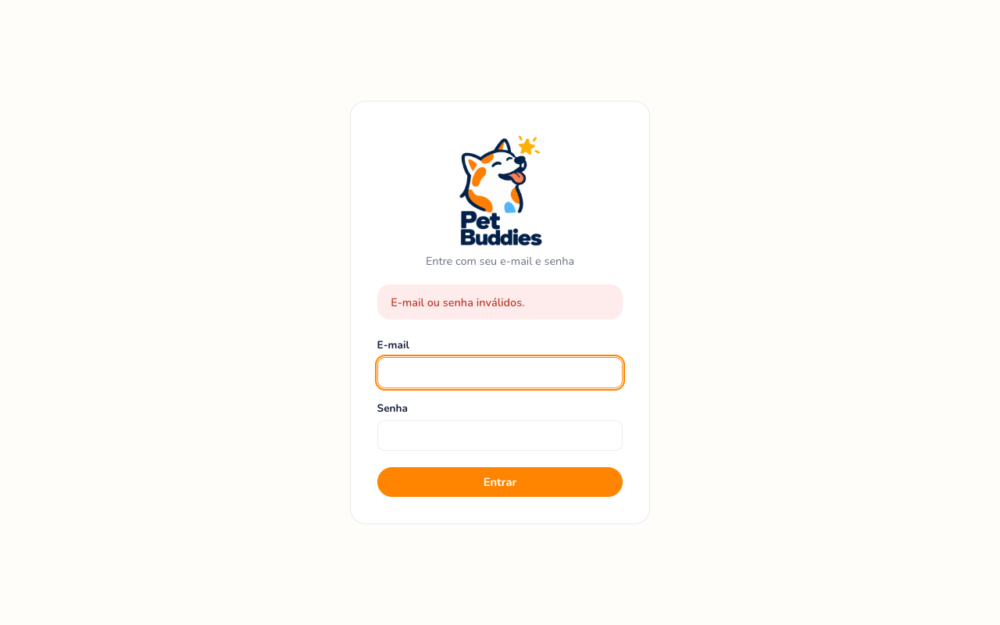<br><b>Login</b> · credencial inválida</td>
<td width="50%" valign="top">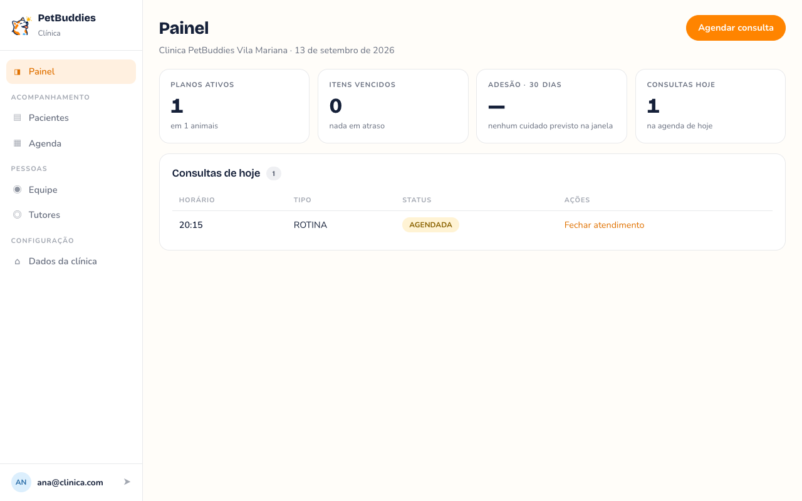<br><b>Painel</b> · indicadores e consultas de hoje</td>
</tr>
<tr>
<td valign="top">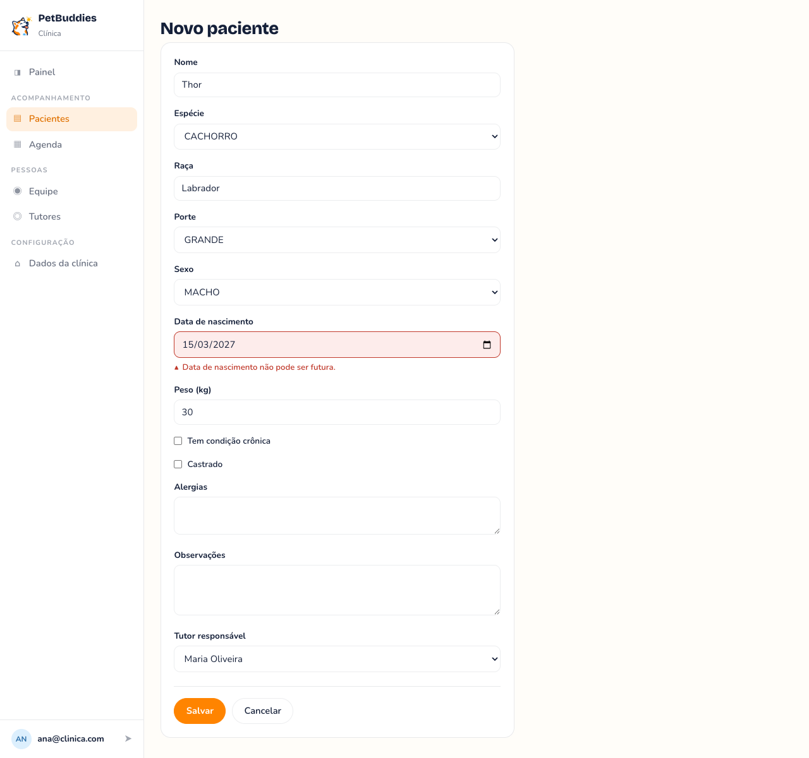<br><b>Novo paciente</b> · validação no campo</td>
<td valign="top">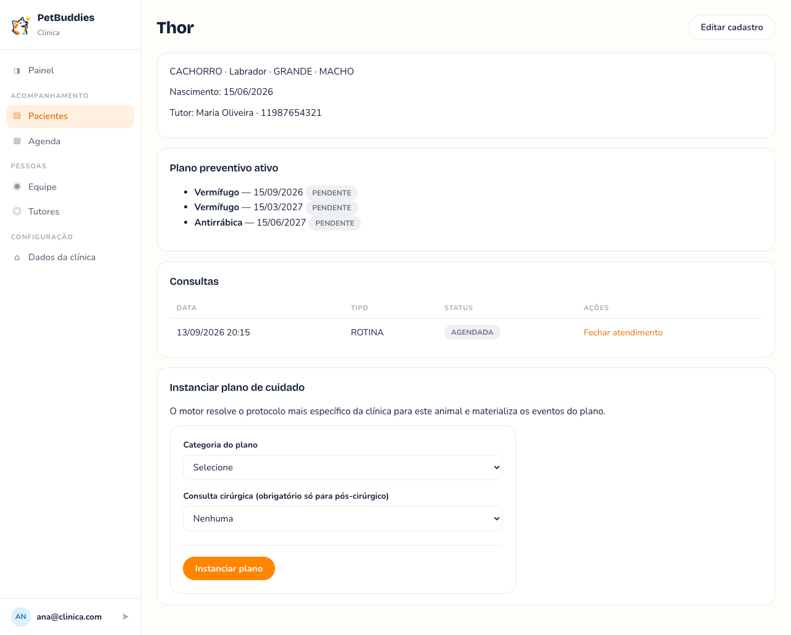<br><b>Ficha</b> · plano preventivo gerado do catálogo e consultas</td>
</tr>
<tr>
<td valign="top">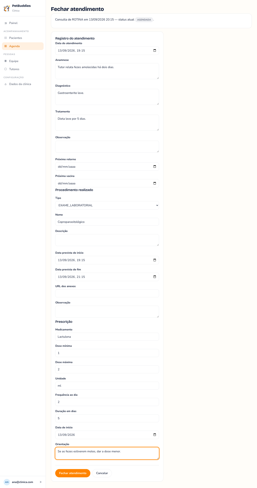<br><b>Fechar atendimento</b> · registro, procedimento e prescrição</td>
<td valign="top">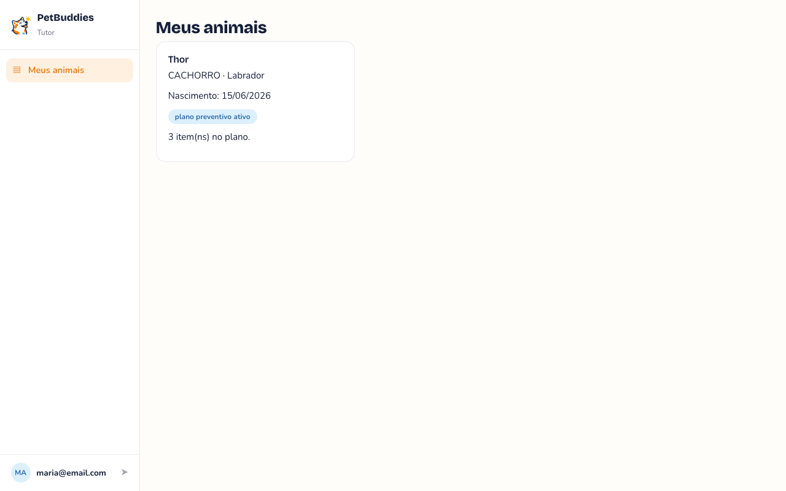<br><b>Meus animais</b> · a tutora vê só os dela<br><br>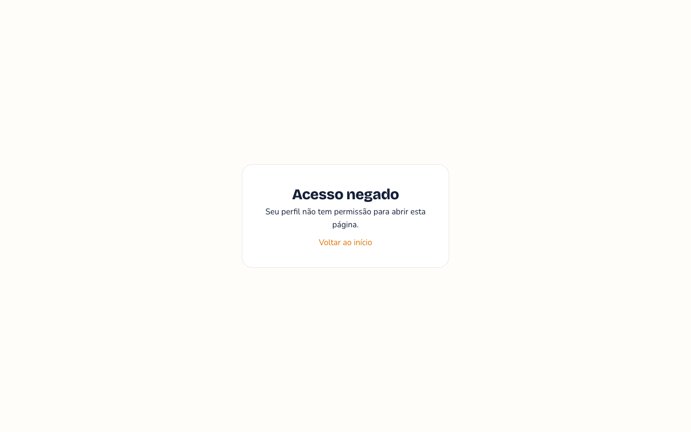<br><b>Acesso negado</b> · tutora abrindo <code>/painel</code></td>
</tr>
</table>

---

## Recursos e Rotas

Respostas de recurso vêm em envelope HATEOAS (`EntityModel` / `CollectionModel`). Erros vêm como `ErrorDto{ code, message }`. Parâmetros, corpos e códigos de cada rota estão no Swagger.

### Saúde

| Método | Rota |
|---|---|
| `GET` | `/actuator/health` |

Aberta, sem token. Responde `200 {"status":"UP"}` com o banco no ar e `503 {"status":"DOWN"}` com o banco fora — sem detalhe dos componentes. É a rota que o health check do `PetBuddies-API` consulta para saber se este serviço está de pé.

### Autenticação

| Método | Rota | O que faz |
|---|---|---|
| `POST` | `/api/auth/login` | login dos dois perfis, devolve o token |
| `POST` | `/api/auth/registro` | cadastra tutor ou veterinário e já devolve o token |
| `POST` | `/api/auth/senha` | troca a senha do usuário do token |

### Cadastro

| Recurso | Rota base | Métodos |
|---|---|---|
| Clínicas | `/api/clinica` | `GET`, `GET /buscar?cnpj=`, `GET /{id}`, `POST`, `PUT /{id}`, `DELETE /{id}` |
| Veterinários | `/api/veterinario` | `GET (?clinicaId=)`, `GET /buscar?crmv=`, `GET /{id}`, `POST`, `PUT /{id}`, `DELETE /{id}` |
| Responsáveis | `/api/responsavel` | `GET (?nome=)`, `GET /{id}`, `POST`, `PUT /{id}`, `DELETE /{id}` |
| Animais | `/api/animal` | `GET (?responsavelId=&nome=)`, `GET /{id}`, `POST`, `PUT /{id}`, `DELETE /{id}` |

### Atendimento

| Recurso | Rota base | Métodos |
|---|---|---|
| Consultas | `/api/consulta` | `GET`, `GET /{id}`, `POST`, `PUT /{id}`, `DELETE /{id}`, `POST /agendamento`, `POST /{id}/cancelamento`, `POST /{id}/fechamento` |
| Janelas de atendimento | `/api/janela-atendimento` | `GET (?veterinarioId=)`, `GET /livres?veterinarioId=&data=` (a partir de agora), `GET /{id}`, `POST`, `PUT /{id}`, `DELETE /{id}` |
| Registros de atendimento | `/api/registro-atendimento` | `GET`, `GET /{id}`, `POST`, `PUT /{id}`, `DELETE /{id}` |
| Procedimentos | `/api/procedimento` | `GET`, `GET /{id}`, `POST`, `PUT /{id}`, `DELETE /{id}` |
| Condições clínicas | `/api/condicao-clinica` | `GET (?clinicaId=)`, `GET /buscar?clinicaId=&codigo=`, `GET /{id}`, `POST`, `PUT /{id}`, `DELETE /{id}` |

### Prescrição

| Recurso | Rota | Métodos |
|---|---|---|
| Prescrições | `/api/prescricao` | `GET`, `GET /{id}`, `POST` — o `POST` recebe `{"prescricoes": [ … ]}` e grava as N do mesmo atendimento numa transação. Sem `PUT`/`DELETE`, é ato imutável |
| Rascunho por IA | `/api/prescricao/rascunho` | `POST` — interpreta a narrativa da vet e devolve prescrição + regras propostas, sem gravar. Exige `VET` |
| Regras de prescrição | `/api/regra-prescricao` | `GET`, `GET /{id}`, `POST` — sem `PUT`/`DELETE` |

### Motor de planos

| Método | Rota | O que faz |
|---|---|---|
| `POST` | `/api/motor/plano/instanciar-preventivo` | cria o plano preventivo do animal, ou devolve o existente |
| `POST` | `/api/motor/plano/instanciar-pos-cirurgico` | idem, para o plano vinculado a uma consulta |
| `GET` | `/api/motor/plano/{animalId}` | plano `ATIVO` do animal, com os itens pendentes |
| `GET` | `/api/motor/plano/{animalId}/eventos` | itens do plano, paginado (`?page=&size=`) |
| `GET` | `/api/motor/plano/{animalId}/protocolo-aplicado` | itens separados em realizados, pendentes e vencidos |
| `GET` | `/api/motor/plano/{animalId}/sugestoes` | próximo cuidado sugerido pelo histórico do animal |

### Check-in

| Método | Rota | O que faz |
|---|---|---|
| `POST` | `/api/checkin/extracao` | passo 1 — interpreta a narrativa; não grava |
| `POST` | `/api/checkin` | passo 2 — grava o confirmado, avalia a regra e grava o desfecho |
| `GET` | `/api/checkin/{id}` | busca por id |
| `GET` | `/api/checkin?animalId=` | check-ins do animal, do mais recente ao mais antigo |

### Roteiro do Fluxo Principal

Na ordem abaixo, com o usuário `VET` de demonstração:

| Passo | Método | Rota | O que observar |
|---|---|---|---|
| 1 | `POST` | `/api/auth/login` | `200` + token; use como Bearer nos passos seguintes |
| 2 | `POST` | `/api/animal` | `201` — paciente para o responsável do seed (`responsavelId: 1`) |
| 3 | `POST` | `/api/condicao-clinica` | `201` — o vocabulário que o check-in vai avaliar |
| 4 | `POST` | `/api/janela-atendimento` | `201` — um slot livre para o veterinário do seed |
| 5 | `POST` | `/api/consulta/agendamento` | `201` — ocupa a janela; a consulta nasce `AGENDADA` |
| 6 | `POST` | `/api/consulta/{id}/fechamento` | `201` — registro, procedimentos e prescrições numa transação; a consulta vira `REALIZADA` |
| 7 | `POST` | `/api/motor/plano/instanciar-preventivo` | `201` — lê o catálogo do .NET e materializa o plano |
| 8 | `POST` | `/api/checkin/extracao` | `200` — a IA interpreta a narrativa contra o vocabulário |
| 9 | `POST` | `/api/checkin` | `201` — o motor decide a dose ou escala à clínica |

> O passo 8 só reconhece condições de uma prescrição ativa. Sem o passo 6, a extração devolve lista vazia — é o escopo do vocabulário funcionando.

### Validações — respostas de erro

| Situação | Exemplo | Status |
|---|---|---|
| Campo obrigatório ausente ou fora de faixa | `POST /api/animal` sem `nome` | `400` |
| Parâmetro de query obrigatório ausente | `GET /api/checkin` sem `animalId` | `400` |
| JSON malformado ou enum inválido | `"especie": "INVALIDO"` | `400` |
| Faixa de dose invertida | `POST /api/prescricao` com `doseMin > doseMax` | `400` |
| Credenciais inválidas | senha errada | `401` — mesma mensagem para login inexistente e usuário inativo |
| Perfil sem permissão | `TUTOR` chamando `POST /api/prescricao/rascunho` | `403` |
| Animal de outro tutor | `TUTOR` chamando `DELETE /api/animal/{id}` num animal que não é dele | `403` |
| Recurso inexistente | `GET /api/animal/999999` | `404` |
| CNPJ, CRMV ou código duplicado | CNPJ repetido | `409` |
| Janela ocupada ou consulta já realizada | agendar em janela ocupada | `409` |
| Check-in duplicado | mesmo animal, data e item | `409` |

---

## Como Testar

### Via Swagger UI

`http://localhost:8080/swagger-ui.html` — endpoints por tag de domínio, com "Authorize" e Try it out. O JSON do OpenAPI fica em **`/api-docs`**, não em `/v3/api-docs`.

### Via Postman

Importe `docs/postman/petbuddies-ai-java.postman_collection.json`, com `baseUrl` em `http://localhost:8080`.

1. Rode **01 · Autenticação → Entrar como veterinária** e **Entrar como tutora**. Cada login guarda o próprio token: `tokenVet` e `tokenTutor`.
2. As pastas estão numeradas na ordem de uso: clínica e equipe, janelas, tutores e animais, consultas e fechamento, prescrição, plano de cuidado e check-in.
3. As pastas herdam `tokenVet`, e a pasta **14 · Check-in** usa `tokenTutor`, porque o check-in é só do tutor. Todo `GET` aceita qualquer um dos dois tokens.
4. **15 · Saúde** chama `GET /actuator/health`, sem token.

A coleção cobre todas as rotas da API, inclusive agendamento, cancelamento e fechamento de consulta, janelas livres, rascunho de prescrição, protocolo aplicado, sugestões e check-in.

---

## Exemplos de Payload

#### `POST /api/auth/login`
```json
{ "login": "ana@clinica.com", "senha": "petbuddies123" }
```

#### `POST /api/animal`
```json
{ "nome": "Rex", "especie": "CACHORRO", "raca": "Vira-lata", "porte": "MEDIO", "sexo": "MACHO",
  "dataNascimento": "2021-03-15", "peso": 18.5, "castrado": true, "responsavelId": 1 }
```

#### `POST /api/motor/plano/instanciar-preventivo`
```json
{ "animalId": 1, "especie": "CACHORRO", "dataNascimento": "2021-03-15" }
```

#### `POST /api/checkin/extracao` — passo 1, interpreta e não grava
```json
{ "animalId": 1, "narrativa": "Ele comeu bem hoje, mas as fezes estavam mais moles que o normal." }
```

A resposta traz `condicoes[]` com `confianca` por item, e `degradado: true` se o modelo falhou.

#### `POST /api/checkin` — passo 2, grava o confirmado
```json
{
  "animalId": 1,
  "narrativa": "Ele comeu bem hoje, mas as fezes estavam mais moles que o normal.",
  "condicoes": [
    { "condicaoClinicaId": 3, "valorBooleano": true, "confianca": 0.92 }
  ]
}
```

#### `POST /api/consulta/{id}/fechamento`
```json
{
  "registroAtendimento": {
    "dataAtendimento": "2026-09-10T14:30:00",
    "anamnese": "Tutor relata apetite normal.",
    "diagnostico": "Gastroenterite leve.",
    "tratamento": "Dieta leve por 3 dias."
  },
  "prescricoes": [
    {
      "medicamento": "Lactulona", "doseMin": 1.0, "doseMax": 2.0, "unidade": "ml",
      "frequenciaDia": 2, "duracaoDias": 5, "dataInicio": "2026-09-10",
      "orientacao": "Se as fezes estiverem moles, aplicar a dose menor.",
      "regras": [
        { "condicaoClinicaId": 3, "acaoDose": "DOSE_MIN", "ordem": 1 }
      ]
    }
  ]
}
```
