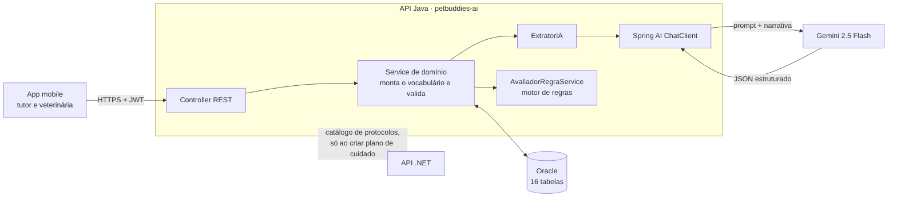
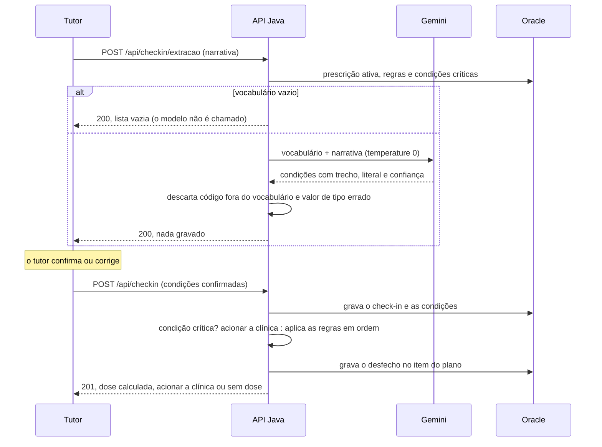

# PetBuddies — Componente de IA | Disruptive Architectures: IoT, IoB & Generative IA

Challenge FIAP 2026 · Clyvo Vet · 2TDS · Sprint 3

**O tutor conta. A IA entende. A veterinária decide.** O PetBuddies usa um LLM para transformar a fala livre do tutor
e da veterinária em dados estruturados, e um motor de regras em Java para decidir, a partir desses dados, o que a
veterinária assinou: a dose do dia ou a orientação de procurar a clínica.

| | |
|---|---|
| Vídeo de apresentação | *link do YouTube (não listado)* |
| Swagger UI (local) | `http://localhost:8080/swagger-ui.html` |

> Esta branch reúne a entrega da disciplina de IA. O código é o mesmo da `main`; o README da `main` descreve a API
> para a disciplina de Java Advanced.

---

## Integrantes do Grupo

| Nome | RM |
|------|----|
| Felipe Yuiti Ishii | 565339 |
| Gabriel Nogueira Peixoto | 563925 |
| Giovanna Neri dos Santos | 566154 |
| Mariana Inoue | 565834 |

---

## 1. O problema

A consulta termina, mas o tratamento continua em casa. A veterinária prescreve uma faixa de dose com condições
("de 1 a 2 ml; se as fezes estiverem moles, a menor dose; se não evacuar em 48 horas, procure a clínica"). A partir
daí, na jornada de cuidado:

- **o tutor decide sozinho** qual dose dar, sem formação para isso;
- **a clínica não fica sabendo**: recebe ligações repetidas ou, pior, não recebe nenhuma, e a adesão cai sem ninguém ver;
- **o sinal clínico se perde**: o que o tutor observa entre uma consulta e outra não chega ao prontuário.

A IA entra num ponto só: a ponte entre **o que o tutor observa, em linguagem de tutor**, e **o que a veterinária
assinou, em linguagem clínica**.

## 2. Abordagem de IA e justificativa

**NLP com LLM e saída estruturada, sobre um vocabulário fechado, combinado com um motor de regras.**

| Etapa | Abordagem | O que faz | O que decide |
|---|---|---|---|
| Entender a fala | NLP com LLM (Gemini 2.5 Flash via Spring AI) | transforma a narrativa livre em JSON tipado, só com códigos do catálogo da clínica | nada |
| Decidir | motor de regras em Java | aplica a regra que a veterinária assinou para aquele paciente | dose dentro da faixa, acionar a clínica ou suspender |

**Por que um LLM para entender a fala.** Uma regra não converte "ele comeu pouco e as fezes tavam moles de manhã" em
campos estruturados: há negação, gíria, ordem livre e número falado. Essa é a única etapa em que um modelo é
insubstituível, e ela não toma nenhuma decisão clínica.

**Por que não um modelo preditivo treinado.** Não existe base aberta de dose veterinária que justifique treinar, e
prescrever dose é ato privativo do médico-veterinário (Resolução CFMV nº 1.465/2022). O conhecimento de dose do
sistema é o que a veterinária assina, paciente por paciente.

**Por que não um chatbot.** Conversa aberta deixaria o modelo orientar conduta. Aqui ele só preenche um schema.

**Por que Spring AI e Gemini.** O Spring AI entrega saída estruturada (`ChatClient` com `.entity(...)`, que devolve a
resposta no formato de um `record` Java) no mesmo processo do motor de regras, sem outro runtime. O Gemini 2.5 Flash
é acessado pela camada compatível com a API da OpenAI.

- `temperature=0`: sem ela a confiança por campo não calibra (medido em 108 chamadas).
- Até 3 tentativas, com backoff exponencial de 2 s a 10 s.

## 3. Como a IA contribui

| Eixo | Como |
|---|---|
| **Apoio à decisão** | O tutor conta como o pet passou; a dose do dia volta calculada pela regra assinada, com o motivo. |
| **Personalização** | O vocabulário enviado ao modelo e as regras são do paciente: a mesma narrativa gera respostas diferentes conforme a prescrição. Na validação, relatos de "passou mal" viraram dose em 13 quadros clínicos e "acionar a clínica" em 5. |
| **Priorização** | Condição marcada como crítica no catálogo da clínica escala antes de qualquer cálculo de dose, sem dose. |

A mesma camada serve a veterinária: ela narra a prescrição e recebe um rascunho do formulário (medicamento, faixa,
frequência, duração e regras "se → então") para revisar e assinar.

## 4. Dados

| Dado | Origem | Estrutura | Quem usa |
|---|---|---|---|
| Narrativa do tutor ou da veterinária | app (corpo da requisição) | texto livre, até 4.000 caracteres | **o modelo** |
| Vocabulário de condições clínicas | `T_PB_CONDICAO_CLINICA` | código, rótulo, tipo (booleano ou numérico), unidade, crítica | **o modelo**, só as condições das regras da prescrição ativa mais as críticas |
| Prescrição (medicamento) | `T_PB_PRESCRICAO` | medicamento, dose mínima e máxima, unidade, frequência, duração | o motor de regras |
| Regras da prescrição | `T_PB_REGRA_PRESCRICAO` | condição, operador, limite, ação (`DOSE_MIN`, `DOSE_MAX`, `DOSE_PADRAO`, `ACIONAR_CLINICA`, `SUSPENDER`) | o motor de regras |
| Perfil do pet | `T_PB_ANIMAL` | espécie, raça, porte, sexo, nascimento, peso, castração | contexto da veterinária ao prescrever |
| Consultas e histórico clínico | `T_PB_CONSULTA`, `T_PB_REGISTRO_ATENDIMENTO` | data, veterinário, anamnese, diagnóstico, tratamento | contexto da veterinária ao prescrever |
| Vacinas e preventivos | `T_PB_PLANO_CUIDADO`, `T_PB_ITEM_PLANO_CUIDADO` | itens com tipo, data prevista e status | plano do tutor; recebe o desfecho do dia |
| Comportamento e sintomas | narrativa do check-in | apetite, fezes, apatia, febre medida | **o modelo**, via vocabulário |
| Check-in e condições observadas | `T_PB_CHECKIN`, `T_PB_CONDICAO_OBSERVADA` | fala crua, canal utilizado, valor confirmado e confiança | registro no prontuário |

O modelo **não** recebe o prontuário inteiro: só a narrativa e o vocabulário que a regra do paciente precisa. A
solução não usa base externa de dose nem dados de terceiros para treino.

## 5. Arquitetura e fluxo de dados



### Check-in do tutor



### Onde está a IA no código

| Arquivo | Papel |
|---|---|
| `infrastructure/ia/ExtratorIA.java` | a chamada ao modelo; falha vira resposta vazia, nunca exceção |
| `service/checkin/CheckinExtracaoService.java` | monta o vocabulário, o prompt do check-in e filtra a resposta |
| `service/checkin/AvaliadorRegraService.java` | o motor de regras: decide dose, acionar a clínica ou sem dose |
| `service/prescricao/PrescricaoExtracaoService.java` | o prompt do rascunho de prescrição e a validação de cada campo |

## 6. Guardrails

| Risco | O que o código faz |
|---|---|
| Modelo inventa um código | descartado antes de chegar ao tutor |
| Valor de tipo errado (sim/não em condição numérica) | descartado antes do banco |
| Extração errada vira decisão | nada é gravado nem calculado sem o tutor confirmar |
| Modelo julgando gravidade | gravidade é do catálogo da clínica (`critica`); observações fora do vocabulário voltam só como texto |
| Veterinária não disse um valor | o campo volta vazio; o prompt proíbe estimar ou calcular por peso |
| Confiança "de fachada" na prescrição | calculada pelo Java: trecho citado e dito literalmente vale 1,0; inferido, 0,6; sem trecho, o campo é descartado |
| Regra com condição fora do catálogo | descartada e listada para a veterinária |
| Modelo fora do ar ou chave inválida | resposta 200 degradada, com preenchimento manual; nunca erro 500 |

## 7. Resultados parciais

**Teste da extração contra o Gemini real** (saída estruturada com schema estrito):

- "não mencionado" volta como ausência de linha; "fezes normais" volta como `false`;
- condição fora do vocabulário ("mancando da pata") vai para observações em texto, sem código inventado;
- na prescrição, "dipirona três vezes ao dia" voltou com dose, unidade e duração vazias;
- **confiança calibrada**: pedir o trecho exato, se foi literal e faixas nomeadas fez a confiança deixar de ser 1,0
  em tudo. "Não quis o jantar" → 0,95; "acho que as fezes tavam diferentes" → 0,50.

**Matriz clínica: 108 cenários.** 6 espécies, 18 quadros clínicos (três por espécie), 23 variáveis, e 6 tipos de
relato por quadro (normal, bem, mal, grave, ambíguo, ruído). Cada cenário percorre a cadeia inteira: narrativa →
extração → regra → desfecho.

| Resultado | Valor |
|---|---|
| Cadeias corretas | **107 / 108** |
| Relatos graves que escalaram para a clínica | **18 / 18** |
| Escalações falsas em relatos normais, bons, ambíguos ou com ruído | **0 / 72** |
| Relatos "mal": dose × acionar a clínica | **13 × 5**, conforme a regra assinada em cada quadro |

A única falha foi sim/não preenchido numa condição numérica, num quadro de coelho: corrigida no prompt e, como
garantia, barrada em Java antes de gravar. A matriz também definiu o escopo do vocabulário: com o catálogo inteiro,
um relato "tudo certo" gerava 15 condições negadas; com só as condições da prescrição ativa, 2.

---

## Como Executar

### Pré-requisitos

- Java 21+ · Maven 3.9+ (este repositório não versiona o Maven Wrapper — use o `mvn` do sistema)
- Docker, para o Oracle local — **ou** acesso ao Oracle FIAP
- Uma chave do Gemini ([Google AI Studio](https://aistudio.google.com))

### Banco local (recomendado)

```bash
cp .env.example .env
# preencha ORACLE_PASSWORD, ORACLE_SYS_PASSWORD, PETBUDDIES_JWT_SECRET e GEMINI_API_KEY

docker compose up -d --wait                          # sobe só o Oracle
mvn spring-boot:run -Dspring-boot.run.profiles=dev
```

Derrube com `docker compose down -v`.

### Oracle FIAP (alternativa)

```bash
cp .env.example .env
# ORACLE_URL já aponta para o Oracle FIAP; preencha ORACLE_USER (seu RM) e ORACLE_PASSWORD

mvn spring-boot:run -Dspring-boot.run.profiles=dev
```

A aplicação sobe em `http://localhost:8080`, com o Swagger em `/swagger-ui.html`.

`GEMINI_API_KEY` ausente do ambiente impede a aplicação de subir; presente mas vazia, a aplicação sobe e as
chamadas de IA respondem degradadas.

### Testando a IA

O seed cria dois usuários: `ana@clinica.com` (`VET`) e `maria@email.com` (`TUTOR`), ambos com senha
`petbuddies123`. A extração do check-in só reconhece condições de uma prescrição ativa, então o cenário é montado
antes, pelo Swagger:

| Passo | Perfil | Rota | Para quê |
|---|---|---|---|
| 1 | `VET` | `POST /api/auth/login` | token da veterinária |
| 2 | `VET` | `POST /api/animal` | paciente do responsável `1` |
| 3 | `VET` | `POST /api/condicao-clinica` | condição do vocabulário, ex. `FEZES_MOLES`, tipo `BOOLEANO` |
| 4 | `VET` | `POST /api/janela-atendimento` | horário livre |
| 5 | `VET` | `POST /api/consulta/agendamento` | consulta na janela |
| 6 | `VET` | `POST /api/consulta/{id}/fechamento` | prescrição de 1 a 2 ml com a regra `FEZES_MOLES → DOSE_MIN`, início hoje |
| 7 | `VET` | `POST /api/prescricao/rascunho` | **IA:** a narrativa da veterinária vira rascunho de prescrição |
| 8 | `TUTOR` | `POST /api/auth/login` | token do tutor |
| 9 | `TUTOR` | `POST /api/checkin/extracao` | **IA:** a narrativa do tutor vira condições, sem gravar |
| 10 | `TUTOR` | `POST /api/checkin` | grava o confirmado e o motor decide a dose |

#### `POST /api/checkin/extracao`
```json
{ "animalId": 1, "narrativa": "Dei o remédio às 20h, mas as fezes tavam moles de novo." }
```

A resposta traz `condicoes[]` com `codigo`, valor, `trecho`, `literal` e `confianca`, e `degradado: true` se o modelo
falhou.

#### `POST /api/checkin`
```json
{
  "animalId": 1,
  "narrativa": "Dei o remédio às 20h, mas as fezes tavam moles de novo.",
  "condicoes": [
    { "condicaoClinicaId": 1, "valorBooleano": true, "confianca": 0.95 }
  ]
}
```

A resposta traz `desfechos[]` com `DOSE_CALCULADA` e a dose aplicada, ou `ACIONAR_CLINICA` sem dose.

#### `POST /api/prescricao/rascunho`
```json
{
  "registroAtendimentoId": 1,
  "narrativa": "Lactulona, de 1 a 2 ml, uma vez ao dia, por 14 dias, começando hoje. Se as fezes estiverem moles, dose mínima."
}
```

A resposta traz a prescrição preenchida, `confiancaPorCampo`, `regrasPropostas` e `condicoesDescartadas`, sem gravar.

---

## Tecnologias

- **Java 21** · Spring Boot 3.4.5
- **Spring AI 1.1.6** (`spring-ai-starter-model-openai`) — `ChatClient` com saída estruturada
- **Gemini 2.5 Flash** — pela camada compatível com a API da OpenAI, `temperature=0`
- Spring Data JPA + Hibernate sobre **Oracle**, com **Flyway**
- Spring Security com JWT · Bean Validation · Springdoc OpenAPI
