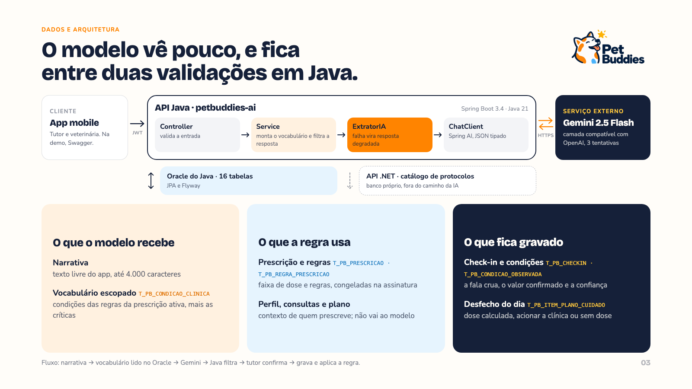
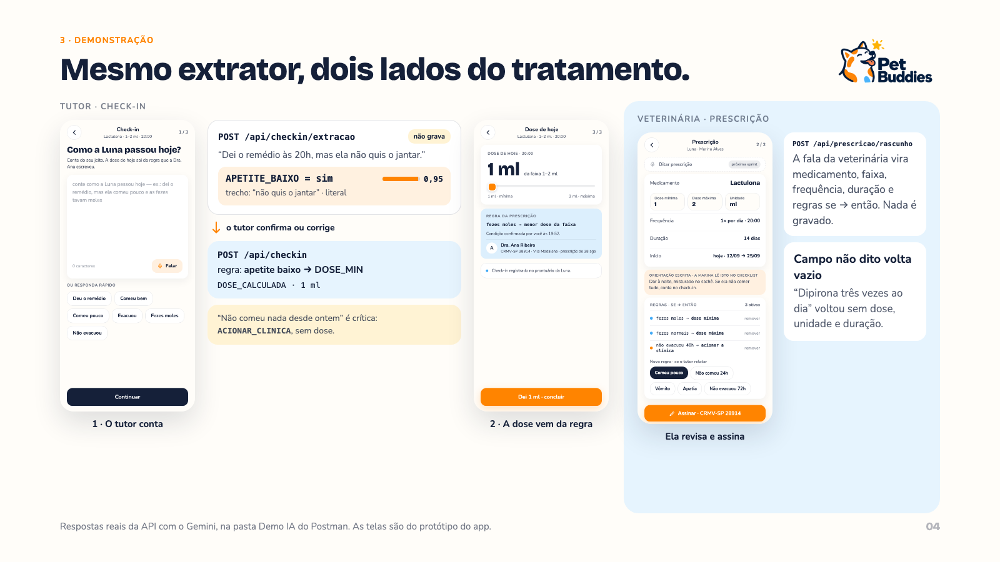
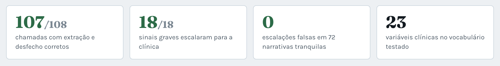
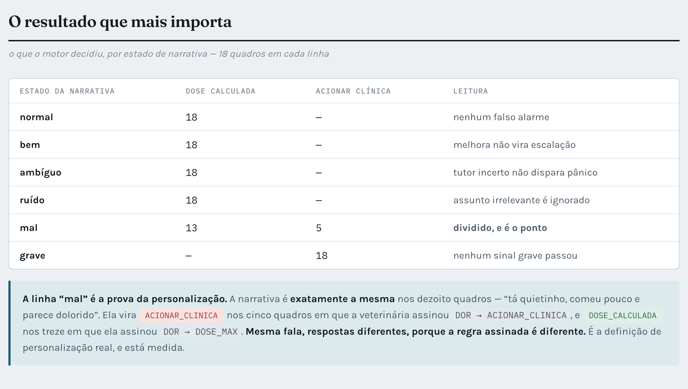
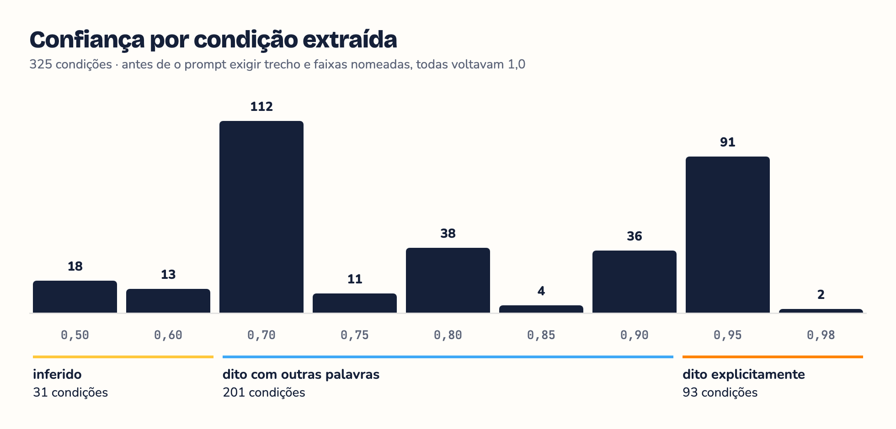

# PetBuddies — Componente de IA | Disruptive Architectures: IoT, IoB & Generative IA

Challenge FIAP 2026 · Clyvo Vet · 2TDS · Sprint 3

**O tutor conta. A IA entende. A veterinária decide.** Um LLM transforma a fala livre do tutor e da veterinária em
dados estruturados; um motor de regras em Java aplica o que a veterinária assinou e decide a dose do dia ou manda
procurar a clínica.

| | |
|---|---|
| Vídeo de apresentação | *link do YouTube (não listado)* |
| Swagger UI (local) | `http://localhost:8080/swagger-ui.html` |

> Esta branch reúne a entrega da disciplina de IA. O código é o mesmo da `main`, cujo README descreve a API para
> Java Advanced.

| Nome | RM |
|------|----|
| Felipe Yuiti Ishii | 565339 |
| Gabriel Nogueira Peixoto | 563925 |
| Giovanna Neri dos Santos | 566154 |
| Mariana Inoue | 565834 |

---

## 1. Problema e abordagem

A consulta termina, mas o tratamento continua em casa. A prescrição diz "de 1 a 2 ml; se ela comer pouco, a menor
dose", e no quarto dia quem escolhe a dose é o tutor, sem formação para isso. A clínica não fica sabendo, e o
que o tutor observa não chega ao prontuário.

**Abordagem: NLP com LLM e saída estruturada, sobre um vocabulário fechado, mais um motor de regras.**

- **O LLM entende** (Gemini 2.5 Flash via Spring AI): lê a narrativa com negação, gíria e ordem livre e devolve JSON
  tipado, só com códigos do catálogo da clínica, citando o trecho que embasa cada campo. Não decide nada.
- **O motor de regras decide** (Java, sem modelo): aplica a regra da prescrição e devolve a dose dentro da faixa,
  "acione a clínica" ou "suspenda".
- **Por que não um modelo treinado:** não há base aberta de dose veterinária, e dose é ato da veterinária
  (Resolução CFMV nº 1.465/2022). **Por que não um chatbot:** conversa aberta deixaria o modelo orientar conduta.

**O que a IA agrega:** apoio à decisão (o tutor deixa de escolher a dose sozinho), personalização (a mesma fala gera
respostas diferentes conforme a regra de cada paciente) e priorização (condição crítica escala antes de qualquer
dose). A mesma camada gera o rascunho de prescrição a partir da fala da veterinária.

## 2. Dados e arquitetura



| Dado | Origem | Quem usa |
|---|---|---|
| Narrativa (comportamento, sintomas) | app, texto livre | **o modelo** |
| Vocabulário de condições clínicas | `T_PB_CONDICAO_CLINICA` | **o modelo**, só as condições da prescrição ativa e as críticas |
| Prescrição e regras (medicamentos) | `T_PB_PRESCRICAO`, `T_PB_REGRA_PRESCRICAO` | o motor de regras |
| Perfil, consultas, histórico, vacinas | `T_PB_ANIMAL`, `T_PB_CONSULTA`, `T_PB_REGISTRO_ATENDIMENTO`, `T_PB_PLANO_CUIDADO` | a veterinária, ao prescrever |
| Check-in, condições confirmadas e desfecho | `T_PB_CHECKIN`, `T_PB_CONDICAO_OBSERVADA`, `T_PB_ITEM_PLANO_CUIDADO` | prontuário |

A IA está em `infrastructure/ia/ExtratorIA.java` (chamada ao modelo), `service/checkin/CheckinExtracaoService.java`
e `service/prescricao/PrescricaoExtracaoService.java` (prompts e validação) e `service/checkin/AvaliadorRegraService.java`
(motor de regras). Configuração: `temperature=0` e até 3 tentativas com backoff.

## 3. Demonstração



Cenário: a veterinária prescreveu Lactulona de 1 a 2 ml com a regra **apetite baixo → menor dose**, e a clínica marca
**sem comer há 24 h** como condição crítica. Os JSON abaixo são respostas reais da API com o Gemini, resumidas aos campos que importam.

| Tela | Requisição | O que a API devolve |
|---|---|---|
| A tutora conta como a Luna passou | `POST /api/checkin/extracao` | as condições que a IA reconheceu, com trecho e confiança; nada é gravado |
| A dose de hoje | `POST /api/checkin` | o desfecho da regra: `DOSE_CALCULADA`, 1 ml |
| Relato preocupante | `POST /api/checkin` | `ACIONAR_CLINICA`, sem dose, com o telefone da clínica |
| A veterinária dita a prescrição | `POST /api/prescricao/rascunho` | o formulário preenchido e as regras propostas, para revisar e assinar |

<details>
<summary><b>Extração</b>: "Dei o remédio às 20h, mas ela não quis o jantar."</summary>

```json
{
  "condicoes": [
    {
      "codigo": "APETITE_BAIXO",
      "rotulo": "Comeu pouco ou recusou a refeição",
      "valorBooleano": true,
      "confianca": 0.95,
      "critica": false,
      "trecho": "não quis o jantar",
      "literal": true
    }
  ],
  "redFlags": [],
  "degradado": false
}
```
</details>

<details>
<summary><b>Check-in confirmado</b>: a regra devolve a menor dose</summary>

```json
{
  "condicoesObservadas": [{ "codigoCongelado": "APETITE_BAIXO", "valorBooleano": true, "confianca": 0.95 }],
  "desfechos": [
    { "medicamento": "Lactulona", "desfecho": "DOSE_CALCULADA", "doseAplicada": 1, "unidade": "ml", "regraAplicadaId": 1 }
  ],
  "escalado": false
}
```
</details>

<details>
<summary><b>Relato preocupante</b>: "Ela não comeu nada desde ontem de manhã e está muito parada."</summary>

Extração: a condição crítica foi inferida (`literal: false`), e o que não está no vocabulário vira observação em texto.

```json
{
  "condicoes": [
    { "codigo": "APETITE_BAIXO", "valorBooleano": true, "confianca": 0.95, "critica": false, "trecho": "não comeu nada", "literal": true },
    { "codigo": "SEM_COMER_24H", "valorBooleano": true, "confianca": 0.8, "critica": true, "trecho": "não comeu nada desde ontem de manhã", "literal": false }
  ],
  "redFlags": ["está muito parada"]
}
```

Check-in: a condição crítica escala antes de qualquer regra.

```json
{
  "observacoesGerais": "Sinal de atenção identificado (Passou 24 horas ou mais sem comer). Procure a clínica: 1140028922.",
  "desfechos": [{ "medicamento": "Lactulona", "desfecho": "ACIONAR_CLINICA", "doseAplicada": null }],
  "escalado": true
}
```
</details>

<details>
<summary><b>Rascunho de prescrição</b>: "Lactulona, de 1 a 2 ml, uma vez ao dia, por 14 dias, começando hoje. Se ela comer pouco, usar a dose mínima."</summary>

`dataInicio` vale 0,6 porque "começando hoje" foi resolvido pelo modelo, não dito como data.

```json
{
  "extracaoDisponivel": true,
  "prescricao": { "medicamento": "Lactulona", "doseMin": 1.0, "doseMax": 2.0, "unidade": "ml", "frequenciaDia": 1, "duracaoDias": 14, "dataInicio": "2026-09-13" },
  "confiancaPorCampo": { "medicamento": 1.0, "doseMin": 1.0, "doseMax": 1.0, "unidade": 1.0, "frequenciaDia": 1.0, "duracaoDias": 1.0, "dataInicio": 0.6 },
  "regrasPropostas": [{ "condicaoClinicaId": 1, "acaoDose": "DOSE_MIN", "ordem": 1 }],
  "condicoesDescartadas": []
}
```
</details>

## 4. Resultados parciais

Matriz de **108 cenários contra o Gemini real**: 6 espécies, 18 quadros clínicos, 6 tipos de relato (normal, bem,
mal, grave, ambíguo, ruído), percorrendo narrativa → extração → regra → desfecho.





A confiança por campo passou a discriminar depois de o prompt exigir o trecho exato e faixas nomeadas; antes, voltava
1,0 em tudo.



**Onde o Java segura o modelo:** código fora do vocabulário é descartado; valor de tipo errado nunca chega ao banco
(foi a única falha da matriz, corrigida no prompt e barrada em Java); nada é gravado sem o tutor confirmar; gravidade
é decidida pelo catálogo da clínica, não pelo modelo; e falha do modelo vira resposta 200 degradada, nunca erro 500.

---

## Como executar

### Pré-requisitos

- Docker, para subir o banco e a API juntos
- Uma chave do Gemini ([Google AI Studio](https://aistudio.google.com))
- Para rodar a API fora do container: Java 21+ e Maven 3.9+ (o repositório não versiona o Maven Wrapper)

### Demonstração da IA (recomendado)

O Oracle e a API sobem em container, com o banco criado do zero pelo Flyway:

```bash
cp .env.example .env
# preencha GEMINI_API_KEY e PETBUDDIES_JWT_SECRET (mínimo 32 bytes: openssl rand -hex 32)

docker compose -f docker-compose.demo.yml up -d --build
curl http://localhost:8080/actuator/health           # {"status":"UP"}; o Oracle leva de 1 a 2 minutos
```

Derrube com `docker compose -f docker-compose.demo.yml down -v`. Para rodar ao lado de outra instância, troque as
portas: `API_PORT=8081 ORACLE_PORT=1522 docker compose -p outra-demo -f docker-compose.demo.yml up -d --build`.

### API fora do container

```bash
docker compose up -d --wait                          # sobe só o Oracle
mvn spring-boot:run -Dspring-boot.run.profiles=dev
```

Para o Oracle FIAP, preencha `ORACLE_URL`, `ORACLE_USER` (o RM, em maiúsculas) e `ORACLE_PASSWORD` no `.env` e rode
só o `mvn`.

| Variável | Para quê |
|---|---|
| `GEMINI_API_KEY` | chave do Gemini. Ausente, a aplicação não sobe; presente mas vazia, sobe e as chamadas de IA respondem degradadas |
| `PETBUDDIES_JWT_SECRET` | segredo `HS256` do token, com no mínimo 32 bytes. Abaixo disso a aplicação recusa subir |
| `ORACLE_URL`, `ORACLE_USER`, `ORACLE_PASSWORD` | conexão com o Oracle; o `.env.example` já aponta para o container local |
| `ORACLE_SYS_PASSWORD`, `ORACLE_PORT` | senha do `SYS` e porta do Oracle no host; só os arquivos do compose usam |

### Usuários de demonstração

A migration `V2__seed_demonstracao.sql` semeia uma clínica, uma veterinária, uma tutora e os dois logins:

| Login | Perfil | Senha |
|---|---|---|
| `ana@clinica.com` | `VET` | `petbuddies123` |
| `maria@email.com` | `TUTOR` | `petbuddies123` |

### Testando a IA pelo Postman

Importe `docs/postman/petbuddies-ai-java.postman_collection.json` (a `baseUrl` já é `http://localhost:8080`) e rode a
pasta **00 · Demo IA** com *Run folder*, num banco recém-criado. Ela não depende das outras pastas: cada requisição
guarda os tokens, ids e datas de que a próxima precisa.

| Subpasta | Quem | O que acontece |
|---|---|---|
| 1 · Preparação (veterinária) | `ana@clinica.com` | cadastra a Luna e as condições `APETITE_BAIXO` e `SEM_COMER_24H` (crítica), agenda e fecha a consulta com Lactulona de 1 a 2 ml e a regra "apetite baixo → menor dose" |
| 2 · IA na prescrição | veterinária | a fala da prescrição vira o formulário preenchido, com a confiança de cada campo |
| 3 · IA no check-in | `maria@email.com` | "não quis o jantar" vira `APETITE_BAIXO`, e a regra devolve a dose de 1 ml |
| 4 · Condição crítica | tutora | "não comeu nada desde ontem" escala para a clínica, sem dose |

São 13 requisições e 21 verificações. As pastas **01 a 15** cobrem o resto da API na ordem de uso: usam `tokenVet` como
padrão e `tokenTutor` na pasta **14 · Check-in**, que é só da tutora.

Pelo Swagger (`/swagger-ui.html`), rode antes a subpasta 1 no Postman. Depois faça `POST /api/auth/login` com a
tutora, cole o `token` em **Authorize** e chame `POST /api/checkin/extracao` e `POST /api/checkin`, com os mesmos
corpos da subpasta 3.

**Tecnologias:** Java 21 · Spring Boot 3.4.5 · Spring AI 1.1.6 · Gemini 2.5 Flash · Spring Data JPA · Oracle ·
Flyway · Spring Security (JWT) · Springdoc OpenAPI
